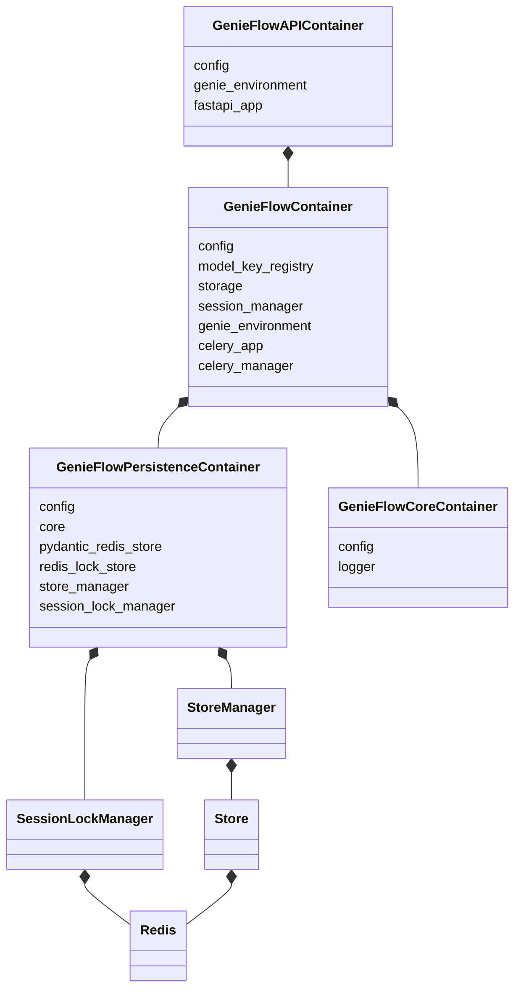

```mermaid
classDiagram
    GenieFlowContainer *-- GenieFlowPersistenceContainer
    GenieFlowContainer *-- GenieFlowCoreContainer
    GenieFlowAPIContainer *-- GenieFlowContainer
    
    GenieFlowPersistenceContainer *-- StoreManager
    GenieFlowPersistenceContainer *-- SessionLockManager
    StoreManager *-- Store
    SessionLockManager *-- Redis
    Store *-- Redis
    
    class GenieFlowCoreContainer{
        config
        logger
    }
    
    class GenieFlowPersistenceContainer{
        config
        core
        pydantic_redis_store
        redis_lock_store
        store_manager
        session_lock_manager
    }
    
    class GenieFlowContainer{
        config
        model_key_registry
        storage
        session_manager
        genie_environment
        celery_app
        celery_manager
    }
    
    class GenieFlowAPIContainer{
        config
        genie_environment
        fastapi_app
    }

```