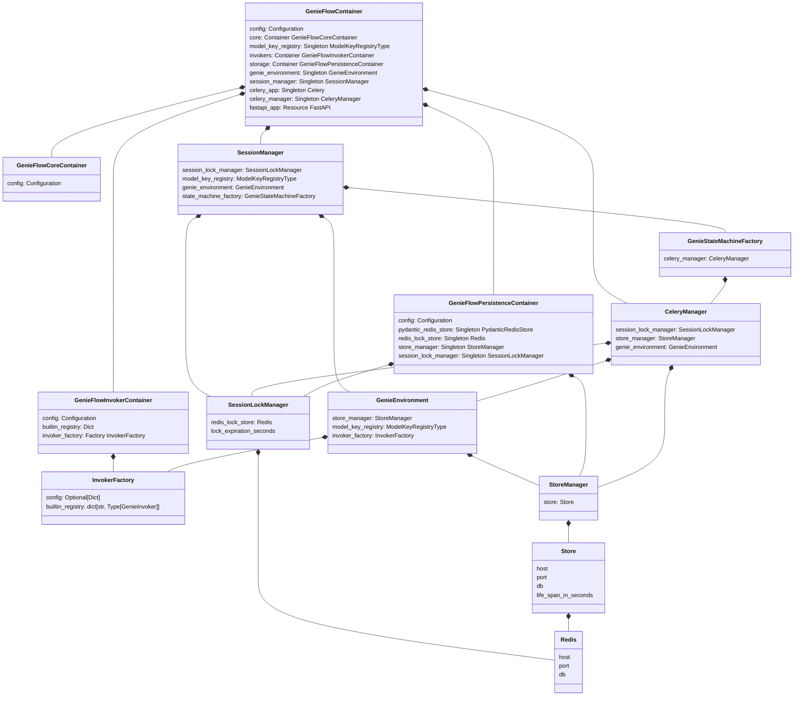

```mermaid
classDiagram
    GenieFlowContainer *-- GenieFlowPersistenceContainer
    GenieFlowContainer *-- GenieFlowCoreContainer
    GenieFlowContainer *-- GenieFlowInvokerContainer
    GenieFlowContainer *-- SessionManager
    GenieFlowContainer *-- CeleryManager
    
    GenieFlowInvokerContainer *-- InvokerFactory
    
    SessionManager *-- SessionLockManager
%%    SessionManager *-- ModelKeyRegistryType
    SessionManager *-- GenieEnvironment
    SessionManager *-- GenieStateMachineFactory
    
    GenieEnvironment *-- StoreManager
%%    GenieEnvironment *-- ModelKeyRegistryType
    GenieEnvironment *-- InvokerFactory
    
    GenieFlowPersistenceContainer *-- StoreManager
    
    GenieStateMachineFactory *-- CeleryManager
    
    CeleryManager *-- SessionLockManager
    CeleryManager *-- StoreManager
    CeleryManager *-- GenieEnvironment
    
    StoreManager *-- Store
    
    GenieFlowPersistenceContainer *-- SessionLockManager
    
    SessionLockManager *-- Redis
    
    Store *-- Redis
    
    class GenieFlowCoreContainer{
        config: Configuration
    }
    
    class GenieFlowPersistenceContainer{
        config: Configuration
        pydantic_redis_store: Singleton PydanticRedisStore
        redis_lock_store: Singleton Redis
        store_manager: Singleton StoreManager
        session_lock_manager: Singleton SessionLockManager
    }
    
    class GenieFlowInvokerContainer{
        config: Configuration
        builtin_registry: Dict
        invoker_factory: Factory InvokerFactory
    }
    
    class GenieFlowContainer{
        config: Configuration
        core: Container GenieFlowCoreContainer
        model_key_registry: Singleton ModelKeyRegistryType
        invokers: Container GenieFlowInvokerContainer
        storage: Container GenieFlowPersistenceContainer
        genie_environment: Singleton GenieEnvironment
        session_manager: Singleton SessionManager
        celery_app: Singleton Celery
        celery_manager: Singleton CeleryManager
        fastapi_app: Resource FastAPI
    }
    
    class StoreManager{
        store: Store
    }
    
    class SessionManager{
        session_lock_manager: SessionLockManager
        model_key_registry: ModelKeyRegistryType
        genie_environment: GenieEnvironment
        state_machine_factory: GenieStateMachineFactory
    }
    
    class GenieEnvironment{
        store_manager: StoreManager
        model_key_registry: ModelKeyRegistryType
        invoker_factory: InvokerFactory
    }
    
    class SessionLockManager{
        redis_lock_store: Redis
        lock_expiration_seconds
    }
    
    class InvokerFactory{
        config: Optional[Dict]
        builtin_registry: dict[str, Type[GenieInvoker]]
    }
    
    class GenieStateMachineFactory{
        celery_manager: CeleryManager
    }
    
    class CeleryManager{
        session_lock_manager: SessionLockManager
        store_manager: StoreManager
        genie_environment: GenieEnvironment
    }

    class Redis{
        host
        port
        db
    }
    
    class Store{
        host
        port
        db
        life_span_in_seconds
    }
```