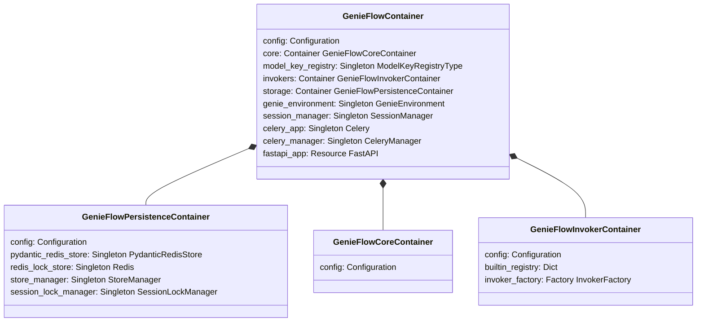

```mermaid
classDiagram
    GenieFlowContainer *-- GenieFlowPersistenceContainer
    GenieFlowContainer *-- GenieFlowCoreContainer
    GenieFlowContainer *-- GenieFlowInvokerContainer
    
    class GenieFlowCoreContainer{
        config: Configuration
    }
    
    class GenieFlowPersistenceContainer{
        config: Configuration
        pydantic_redis_store: Singleton PydanticRedisStore
        redis_lock_store: Singleton Redis
        store_manager: Singleton StoreManager
        session_lock_manager: Singleton SessionLockManager
    }
    
    class GenieFlowInvokerContainer{
        config: Configuration
        builtin_registry: Dict
        invoker_factory: Factory InvokerFactory
    }
    
    class GenieFlowContainer{
        config: Configuration
        core: Container GenieFlowCoreContainer
        model_key_registry: Singleton ModelKeyRegistryType
        invokers: Container GenieFlowInvokerContainer
        storage: Container GenieFlowPersistenceContainer
        genie_environment: Singleton GenieEnvironment
        session_manager: Singleton SessionManager
        celery_app: Singleton Celery
        celery_manager: Singleton CeleryManager
        fastapi_app: Resource FastAPI
    }

```