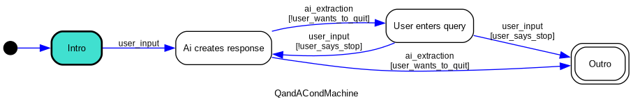
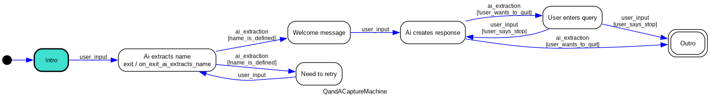
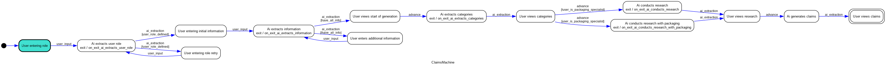
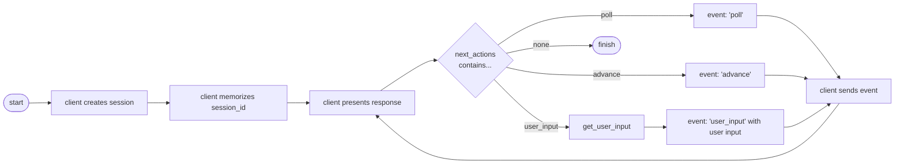

# Genie Flow
The Genie Flow Framework is intended to make it easy to design and implement dialogues between a
Human user and an LLM. Such dialogue is typically directed through a number of stages. Often they
start with a preamble, then some information retrieval, some conclusion building and an epilogue.

Keeping that state in check: what prompt should be used, given what has been discussed so far, is
not trivial. And when implemented using simple if / then / else logic, the code becomes hard to 
maintain.

This package aims to simplify and streamline the creation of dialogue flows that have a user
interact with an LLM.

The main concept of Genie Flow is to maintain a State Machine, coupled with a Data Object.
The State Machine to direct the flow and determine which prompts to invoke when during the
conversation. The Data Object to carry all data that is gathered during the conversation.

These are only two classes that a developer would need to implement. The Genie Flow framework
takes care of creating sessions, persisting data, maintaining the dialogue history, calling
the LLMs asynchronously, and other feats.

## Genie Model
This is just a [pydantic](https://docs.pydantic.dev/latest/) model that can have as many fields as
one needs. A developer would subclass the `GenieModel` class, which adds a number of required
fields and methods. That `GenieModel` class also implements all functionality to persist it into
a Redis database. That functionality is based on the package [Pydantic-Redis](https://sopherapps.github.io/pydantic-redis/)
which implements the necessary ORM functionality.

### data object class fields

`state`
: This is the current state the accompanying State Machine is in. It is a string or an integer.
Best not to be touched by the developer.

`session_id`
: The unique id of a session that this Data Object belongs to. Best not to be touched by the
developer.

`dialogue`
: A list of `DialogueElement`s that is the sequence of uttering by the different actors involved
in the dialogue.

`actor`
: The name of the actor that has most recently uttered a statement. By default, this is `USER` for
a Human actor and `LLM` for an LLM.

`actor_input`
: The input that was last uttered by the most recent actor.

`parsed_actor_input`
: If the `actor_input` was a JSON serialized object, this property will contain the object value
as parsed.

### data object methods and properties

The developer needs to implement the class method  `get_state_machine_class` which should return
the class that implements the State Machine that accompanies this Data Object. A new State Machine
is then created by `model.get_state_machine_class()(model=model)`.

Some convenience methods exist:

`current_response`
: A property that returns the most recent uttering of an actor. Or `None` if there is none.

`format_dialogue`
: Returns a string representation of the dialogue, using some pre-defined formats. See the 
`DialogueFormat` class for more details.

### related objects
If a developed needs to maintain a relation to other objects that are not base classes, the class
of that other object also needs to be ORM-able. This is achieved by inheriting that other class
not from `BaseModel` as is done for Pydantic, but by inheriting from `Model` which comes from the
Pydantic-Redis package.

This also means that this other object needs to have a class property called `_primary_key_field`
which is the name of the field that uniquely identifies an instance of that object.

For example, the `DialogeElement` class (of which the `GenieModel` maintains a list) is implemented
as follows:

```python
import uuid

from pydantic import Field
from pydantic_redis import Model

class DialogueElement(Model):
    _primary_key_field = "id"

    id: str = Field(default_factory=lambda: uuid.uuid4().hex)
    
    # other fields and methods
```

And with that implementation, the `GenieModel` can now maintain a list of `DialogueElement`s that
are then also persisted into Redis. Like so:

```python
from pydantic import Field
from pydantic_redis import Model

class GenieModel(Model):
    _primary_key_field: str = "session_id"

    dialogue: list["DialogueElement"] = Field(
        default_factory=list
    )

    # other fields and methods
```

### Registering Models
When the developed has created a new `GenieModel`, that new model needs to be registered. This will
make that model recognized to the Pydantic-Redis ORM framework. This registration is done as follows:

```python
from ai_state_machine import GenieFlow
from ai_state_machine.genie import GenieModel


class MyNewModel(GenieModel):
    ...


genie_flow = GenieFlow.from_yaml("config.yaml")
genie_flow.genie_environment.register_model("my_genie", MyNewModel)

```

From that point onwards, the class `MyNewModel` can be persisted and therefore used by the Genie
Flow framework. This registration also makes the model and accompanying state machine available
at the API, under the model key `my_genie`.

Remember that this also needs to be done for any additional models that may be referred to by this
`MyNewModel` class.

## Genie Flow state machine principles
The backbone of the Genie Flow framework is defined by the State Machine. The Genie Flow State
Machine is based on the package [Python State Machine](https://python-statemachine.readthedocs.io/en/latest/)
and the `GenieStateMachine` is a direct subclass of the `StateMachine` class that is defined there.

The `GenieStateMachine` class implements the base logic of the Genie Flow. A State Machine defined
the different states (nodes in a graph) and the transitions (edges in the graph) that can be made
between these states.

### Question and Answer example
A simple Question and Answer dialogue flow would look like this:


Here it becomes apparent that a dialogue is played between an "AI" and a human actor. The
dialogue stars with the initial state (color coded) called `Intro`. From that initial state
the only transition that can be made is the one called `user_input`, which transitions into
`Ai creates response`. From there, a transition called `ai_extraction` brings the state
machine into the state called `User enters query`. From there, the only transition is again
a `user_input` transition, back to the `Ai creates response`.

This example shows a number of foundational elements:

states
: A state machine contains a number of states between which the state machine can transition.
A machine can only be in one state at any single time. The transitions that can be made from
one state to another are predefined and fixed. Only one initial state is defined. It is the
state where a newly instantiated state machine starts in.

transitions
: From any state there can be zero, one or more transitions into other states. If there are
zero states, that state is a final state, of which there can be multiple, or none as in the
Q and A example. Every transition has the name of an event, which is the event that will
trigger that particular transition.

events
: An event is what makes the state machine transition from one state to the next. In Genie
Flow, events are either sent through the API or received from the internal workings, for 
instance, when an LLM has finished rendering, and it's output is ready for processing.

### Question and Answer example with conditions
This first example gives a good impression of the elements that are relevant for creating a
Genie Flow application. The dialogue, however, is simplistic and never-ending. Now, consider
the following flow diagram:



It is almost the same Question and Answer flow, except that we have now introduced conditions.
There are now two `ai_extraction` event transitions from the state `Ai creates response`. One
that has the connotation `user_wants_to_quit` and the other with `!user_wants_to_quit`.
Indicating that the user wants to quit, or the user does not want to quit - indicated by 
the `!` mark, pronounced as "not".

So when the LLM determines the user wants to quit, we want the flow to go to the state called
"Outro". If not, we follow the normal path towards the state "User enters query".

A similar thing has been done with the `user_input` events out of the state "User enters query".
Here we have another condition called `user_says_stop` that tells the state machine to either
go to the "Ai creates response", in the case where "Not user says stop" (`!user_says_stop`),
or to the state "Outro" in the case where "user says stop" (`user_says_stop`).

These conditions are a first step towards creating more complex dialogues. It enables us to
make different paths through the dialogue.

### Question and Answer example with data capture
So far we have not yet seen how data that is entered by the user is captured and stored. Now
imagine the following Genie Flow:



In this flow, the user is asked for their name. That username is extracted and stored in the
data model. The extraction is done through an LLM. The response of that LLM should be either
the name of the user or the term `UNDEFINED`. In the latter case, the user is asked again to
state their name (state `Need to retry`). The condition `name_is_defined` ensures the state 
machine directs the user towards the Welcome message or that retry.

One new element on state `Ai extracts name` is the `exit / on_exit_ai_extracts_name` method.
This is the method that is called when the state machine exists the state `Ai extracts name`.
So this is when the LLM has conducted it extraction and the response is available. This is the
moment during the conversation that the programmer has control to change values in the data
model attached to the state machine.

actions
: When entering or exiting states, the programmer has control over what happens. Typically,
these moments are used to capture responses from the LLM or users and adapt the content of an
attached data model object.

### Genie Flow templating
The final concept that is introduced by Genie Flow is the idea that every state maintains a
template. That could be a template to construct the text that should be sent to the user or
the template that is used to construct the text that is sent to the LLM.

The flow is as follows:


When the state machine traverses from one state to the next, Genie Flow takes the template that
is attached to the target state, renders the template with the data model object and provides
it to the actor that needs it. If the event triggering the transition is a `user_input` event,
then the next actor is an LLM. In case the event for the transition is `ai_extraction` then the
next actor is the user.

For templating, Genie Flow uses [Jinja2](https://jinja.palletsprojects.com/en/3.1.x/), a powerful
templating engine.

When rendering the template, all attributes of the data model are available. Additional attributes
that are available are:

state_id
: The id of the state. This is the class property name that is given to the state.

state_name
: The name that is formed from the `state_id`. This is done by capitalizing the first letter and
replacing underscores by space characters.

chat_history
: This is a serialization of the complete dialogue history, formatted using
the `DialogueFormat.CHAT` format. (see XXX)

### conclusion
In the previous examples we have seen how, through `states`, `transitions`, `events`, `conditions`,
`actions` and `templates`, the programmer has complete control over how a dialogue flows and how
data is captured and presented along the way.

In the next chapter, we will go through these same three examples, but then with the actual 
Genie Flow code.

## Genie Flow Code Examples
### Question and Answer
The first, simple Question and Answer dialogue can be defined as follows:

```python
from statemachine import State

from ai_state_machine.genie import GenieModel, GenieStateMachine


class QandAModel(GenieModel):

    @classmethod
    def get_state_machine_class(cls) -> type["GenieStateMachine"]:
        return QandAMachine


class QandAMachine(GenieStateMachine):

    # STATES
    intro = State(initial=True, value=000)
    user_enters_query = State(value=100)
    ai_creates_response = State(value=200)

    # EVENTS AND TRANSITIONS
    user_input = intro.to(ai_creates_response) | user_enters_query.to(ai_creates_response)
    ai_extraction = ai_creates_response.to(user_enters_query)

    # TEMPLATES
    templates = dict(
        intro="q_and_a/intro.jinja2",
        user_enters_query="q_and_a/user_input.jinja2",
        ai_creates_response="q_and_a/ai_response.jinja2"
    )

```

#### data model
First, the `QandAModel` data model class is defined. Mark that this is a subclass of `GenieModel`
making sure that all the required properties are available and the newly created data model
can be persisted. This new data model class is in essence a pydantic model. All features of 
the pydantic framework can be used.

In this example there is not much happening as we are not extracting any data from the dialogue,
except for the dialogue itself - which is a standard feature of Genie Flow.

#### state machine - states
Secondly we defined the state machine class `QandAMachine`, which is a subclass of 
`GenieStateMachine` to ensure the base Genie Flow functionality is available. Within this class
we define our `states`, `transitions` and `templates`.

States are class properties, instantiated with a `State` object. This is the Python State Machine
object identifying a state machine state. Here we see the state `intro` getting the flag
`initial=True`, which identifies this state to be the initial state (of which there can only
be one). Since this example shows a never ending dialogue, there is no state with the predicate
`final=True`.

All states in this `QandAMachine` class have a unique `value`. This is a `str` or `int` that
uniquely identifies the state. These are defined by the developer and their value is
insignificant.

#### state machine - events and transitions 
We also define the transitions that are possible between states. This is done by assigning
transitions to the event that triggers them. So in this example, the event `user_input` will
make the machine transition to the state `ai_creates_response` when it is currently either in
the state `intro` or the state `user_enters_query`. Here the two transitions, `intro` to
`ai_creates_response` and `user_enters_query` to `ai_creates_response` are chained together using
the `|` character.

The event `ai_extraction` is defined to trigger the remaining transition of this state machine,
which is the transition between `ai_creates_respponse` to `user_enters_query`.

#### state machine - templates
And finally, we define the templates that are linked to each and every state. This is done by
implementing a class property called `templates` that is instantiated with a dictionary. Every
state should be a key in that dictionary, referring to the path to the Jinja2 file with the
given template.

> At this point in time, the Jinja2 environment needs to be told where to find the templates.
> This is done at application start-up by calling the following function:
> `register_template_directory("q_and_a", "example_qa/templates")`, imported as
> `from ai_state_machine.templates import register_template_directory`. The prefix `q_and_a`
> serving as a virtual directory when referring to a specific file.

At initiation of a new Genie Flow state machine, it is checked to see if all states have a
template assigned and will raise an exception if not all of them have one.

Templates are used to both render the output that needs to be sent to the user as well as the
prompt that needs to be sent to the LLM. They are Jinja2 templates, and are rendered with the
data that is captured so far. For example, the `intro` state has the following template:

```jinja2
Welcome to this simple Question and Answer dialogue Genie Flow example!

How can I help? Please go ahead and ask me anything.
```

This is the template that is sent to the user as a welcome message. When the user then enters
a query, a prompt is sent to the LLM. That prompt is constructed using the template that is 
linked to the state `ai_creates_response`:

```jinja2
You are a friendly chatbot, aiming to have a dialogue with a human user. You will be given
the dialogue that you have had before, followed by the most recent response from the user.
Your aim is to respond logically, taking the dialogue you had into account.

---
*** DIALOGUE SO FAR ***
{{ chat_history }}
---

---
*** MOST RECENT HUMAN STATEMENT ***
{{ actor_input }}
___

First assert if the most recent human statement indicated that the user wants to stop the dialog.
If the user wants to stop the dialogue, just say **STOP**.

If the user does not want to stop, respond.
Be succinct, to the point, but friendly.
Stick to the language that the user start their conversation in.
```

Here the power of Jinja2 comes to bear. The template contains "mustache notation" to indicate
the placeholders for data attributes. So will `{{ actor_input }}` be replaced by the most
recent statement by the most recent actor. Any attribute of the `QandAModel` is available
inside the template.

That makes the template for state `user_enters_query` straight forward:

```jinja2
{{ actor_input }}
```

Meaning that it just prints the output of the LLM. Because, when this template gets rendered,
the actor was the LLM and the attribute `actor_input` will be the output of the LLM.

Developing a subclass of

### Question and Answer with Conditions
Putting conditions on transitions is straight forward. In the source code of 
[q_and_a_cond.py](../example_qa/q_and_a_cond.py) it can be seen that we introduced a state
`outro`, with an attribute `final=True`, which indicates this is a final state from which
no more transitions can be made.

There are also added conditions to some of the transitions, as can be seen from this snippet:

```python
    user_input = (
            intro.to(ai_creates_response) |
            user_enters_query.to(ai_creates_response, unless="user_says_stop") |
            user_enters_query.to(outro, cond="user_says_stop")
    )
```

Here, the event `user_input` will trigger a transition from state `intro` to `ai_creates_response`
without any condition. But the transition from `user_enters_query` will be only be towards
state `ai_creates_response` **unless** `user_says_stop` and towards the state `outro` under the
condition `user_says_stop`. In normal words: if the user says stop, we transition directly to
the `outro` state, otherwise we go to state `ai_creates_response`

These conditions are plain Python methods that we defined on our state machine class:

```python
from statemachine.event_data import EventData

from ai_state_machine.genie import GenieStateMachine


class QandACondMachine(GenieStateMachine):
    ...

    def user_says_stop(self, event_data: EventData):
        return (
                event_data.args is not None and
                len(event_data.args) != 0 and
                event_data.args[0] == "*STOP*"
        )
```

> This method is called as the very first method when our state machine receives an event that
results in a transition with a condition. In the order of play, our Genie Flow code by then
has not yet had a chance to do anything, so we need to deal with the raw `EventData` object
that is passed by the Python State Machine framework.

This method just checks the data that is received with the event. The `EventData` class carries
a list of arguments that were passed when the event got sent. So it is checked to see if it is
not `None`, does not have zero length and if the first parameter has the value `*STOP*`. This
is the text that a user can enter to indicate they are done with the dialogue and want to stop.

The condition is linked to the transition by stating the name of the method, as can be seen from 
the above snippet. They can be stated "positively" (as in: this must be `True` to make the
transition), by making it a `cond` on the transition. They can also be stated negatively
(as in: this must be `False` to make the transition), by making it an `unless` condition.

#### Value Injection
The Python State Machine engine takes care of injecting relevant values into condition
methods. As described in [Dependency Injection](https://python-statemachine.readthedocs.io/en/latest/actions.html#dependency-injection),
the following values are available:

event
: The name of the event that triggered the transition

event_data
: An `EventData` object containing all event related values

source
: The `State` that the engine transitions out of

target
: The `State` that the engine transitions into

state
: The current `State` the machine is in

model
: A reference to the model attached to the state machine

transition
: A `Transition` object carrying the transition information

### Question and Answer with data capture
The final Question and Answer example captures the username. This means we now want to capture
that name and be able to use it in our templates. Example code for this can be found in
[q_and_a_capture.py](../example_qa/q_and_a_capture.py).

#### data model
We now need to add the `user_name` as a property to our data model. It is the data attribute 
that we want to capture and carry across the dialogue.

```python
from typing import Optional

from pydantic import Field

from ai_state_machine.genie import GenieModel


class QandACaptureModel(GenieModel):
    user_name: Optional[str] = Field(None, description="The name of the user")

    ...
```

In true Pydantic style, we define the class property `user_name` to be an optional `str`, have a
default value of `None` and we give it a short description. This now means that our data model
has a property `user_name` that is persisted and available when templates get rendered.

#### data capture
We now also need to program the capturing of the data. In this example, the user enters their
name, which is then extracted using an LLM prompt. If the LLM cannot make out the name, the
user is asked again to state their name. This validation is done by commanding the LLM to respond
with a given token if it cannot make out a username, using the following LLM template:

```jinja2
You will be given a human response to the question "what is your name".
Your task is to extract the name of the user from that response.
If you can not determine that name, just respond with UNDEFINED.
If you can determine that name, just response with the name, nothing else.
```

This means we can define a condition as follows:

```python
    def name_is_defined(self, event_data: EventData) -> bool:
        return (
            event_data.args is not None and
            len(event_data.args) != 0 and
            event_data.args[0] != "UNDEFINED"
        )
```

But the main meal here is the definition of a method that gets called when the LLM _has_ extracted
the username. This is done by the following method on our `QandACaptureMachine` class:

```python
from ai_state_machine.genie import GenieStateMachine


class QandACaptureMachine(GenieStateMachine):
    ...

    def on_exit_ai_extracts_name(self):
        self.model.user_name = self.model.actor_input

```
At the time the state `ai_extracts_name` is exited, the `actor_input` property of our data model
contains the value that is returned by the LLM. In the sunny day scenario, that contains the name
that is stated by the user. We therefore assign it to the data model property `user_name`.

Bear in mind that at this stage, we only know we are transitioning out of the `ai_extracts_name` state,
not if the username has been extracted. That is determined by the condition. So we could be assigning
the value `UNDEFINED` to `model.user_name`. An alternative would be to create the following method:

```python
from ai_state_machine.genie import GenieStateMachine


class QandACaptureMachine(GenieStateMachine):
    ...

    def on_enter_welcome_message(self):
        self.model.user_name = self.model.actor_input
```

This message would be called when we enter the state `welcome_message`, a point in the flow where we know
we have a username that is different from `UNDEFINED`.

> Either of these methods is called after the Genie Flow framework has had a chance to process
> information. So we can refer to `model.actor_input`.

#### conclusion
We have now seen how the concepts laid out in the previous chapter can be expressed in code.

## Advanced Genie Flow concepts
With the tools described so far, one is already able to create sensible dialogues. But there are some
nifty tricks to pull even more from the framework.

With the `user_input` and `ai_extraction` events, dialogues that play tennis between the user
and an LLM can be implemented. The order always look something like:

1. Genie Flow sends an initial text to the user
2. User sends their input as part of a `user_input` event
3. LLM compiles a response and sends their input as part of an `ai_extraction` event
4. Genie Flow sends that response to the user
5. Repeat from step 2, unless a final state has been reached

Running LLM queries can be time-consuming. Also, the true power of using LLMs comes to bear when
a prompt is split into multiple parts. For instance, for
[Step Back Prompting](https://arxiv.org/pdf/2310.06117), you want a first prompt like "do a step
back and tell me about the general rules that apply to this problem" and then adding the response
to that step back prompt as context to the original query. But there are many cases where you
would want to string together a number of consecutive prompts.

Genie Flow has a number of advanced features that enable the programmer to do exactly that.

### the `advance` event
When the intermediate results of a string of prompts need to be fed back to the user, the
programmer can introduce transitions on an `advance` event. These events can be sent to the
state machine to make it advance onto the next transition without receiving any new user input.

For example, look at the following summary from the
[Claims Genie code](../example_claims/claims.py). That example implements the following Genie Flow



Some interesting parts from that code are:

```python
from statemachine import State

from ai_state_machine.genie import GenieStateMachine


class ClaimsMachine(GenieStateMachine):
    ...
    # STATES
    ai_extracts_information = State(value=200)
    user_views_start_of_generation = State(value=300)
    ai_extracts_categories = State(value=310)

    # EVENTS AND TRANSITIONS
    ai_extraction = ai_extracts_information.to(user_views_start_of_generation, cond="have_all_info")

    advance = user_views_start_of_generation.to(ai_extracts_categories)

    ...
```

The dialogue at some stage enters the state `ai_extracts_information`, meaning that some information
is extracted from the dialogue. When all the information is gathered (`cond="have_all_info"`) the
user is shown this summary.

Here we have defined a transition from the state `user_views_start_of_generation` towards the
state `ai_extracts_categories`. The idea being that when that first state is reached, the user is
sent some intermediate results (in this case a summary of the information gathered so far) upon
the user front-end has the option to advance the state machine by sending it an `advance` event.
The state machine then advances towards the state `ai_extracts_categories` where further processing
is done.

This means that the output of an LLM, in this case from the prompt attached to state
`ai_extracts_information`, is sent to the user who can view it. The front-end should then send 
an `advance` event back to Genie Flow to make it advance to the next state
`ai_extracts_categories`.

This way the user can stay abreast of what is happening in the background, learn some intermediate
results, and take away some of the waiting time experience when they are just looking at a screen
where nothing happens.

### chaining and branching
Although the `advance` event is a great way to chain the output of one prompt into the input of
a next, it takes a cycle across the front-end to progress the dialogue and make it go to the
next stage.

Chaining templates in the backend means that the front-end is not updated with any intermediate
results and no cycles are needed between the back- and front-ends.

The way to chain multiple subsequent calls to an LLM, where the output of the one is added to the
input for the next, is done by putting the two consecutive templates in a list. For instance the
[q_and_a_trans.py](../example_qa/q_and_a_trans.py) has the following templates defintions:

```python
from ai_state_machine.genie import GenieStateMachine


class QandATransMachine(GenieStateMachine):
    ...

    # TEMPLATES
    templates = dict(
        intro="q_and_a/intro.jinja2",
        user_enters_query="q_and_a/user_input.jinja2",
        ai_creates_response=[
            "q_and_a/ai_response.jinja2",
            "q_and_a/ai_response_summary",
        ],
    )
```

Here the template assigned to the state `ai_creates_response` is assigned a list of templates.
The first one is the original template that creates the prompt for the LLM. The second one is
something like:

```jinja2
Summarize the following text into one paragraph that is not longer than 50 words.
Be strictly to the point, use short sentences and leave out all fluff words.
Also do not use words with more than two syllables.

---
{{ previous_result }}
```

This template takes the output of the previous prompt and directs the LLM to summarize that into
a paragraph of not more than 50 words. The result of the previous prompt is available to the 
template as the property `previous_result`. Any other model properties as also available as in
any normal template rendering.

This construct makes it easy to string together prompts that follow from one to the next. And
that is very useful when a next prompt is dependent on the output of a previous one. If that is
not the case, we could branch off into separate prompts that are executed in parallel. This
branching is done by assigning a dictionary of prompts. This is done in the
[Claims Genie example](../example_claims/claims.py) as in the following extract:

```python
from ai_state_machine.genie import GenieStateMachine

GenieStateMachine


class ClaimsMachine(GenieStateMachine):
    ...

    templates = dict(
        ai_extracts_categories=dict(
            user_role="claims/prompt_extract_categories_user_role.jinja2",
            product_description="claims/prompt_extract_categories_product_description.jinja2",
            target_persona="claims/prompt_extract_categories_target_persona.jinja2",
            further_info="claims/prompt_extract_categories_further_information.jinja2",
        )
    )

```

Here the template assignment for state `ai_extracts_categories` is to a dictionary of different
templates. The Genie Flow framework will create separate LLM calls for each of the keys in that
dictionary that are then run in parallel. The result that is returned is a dictionary with
these same keys and the outputs of the LLM for each of the rendered templates.

Of course, the chaining and branching of templates can be combined. So you can chain together
different branching templates following each other, followed by a simple template, like 
expressed in the following snippet:

```python
some_state=[
    dict(
        foo="foo-template.jinja2",
        bar="bar-template.jinja2",
    ),
    dict(
        foo_foo="foo-foo-template.jinja2",
        bar_bar="bar-bar-template.jinja2",
    ),
    "finalize.jinja2",
]
```

This would first run the `foo` and `bar` templates in parallel, feed the output of that (a 
dictionary with the outputs of each individual prompt) into the `foo_foo` and `bar_bar` templates
that are also run in parallel. The `finalize` template is then executed with a dictionary with 
keys `foo_foo` and `bar_bar`, each with the output generated by sending the respective rendered 
templates as prompt to the LLM.

Remember that the result of a previous LLM call in the chain will be available in the property
`previous_result`. If the previous step in the chain was a branching template (a dictionary of
templates), that property will contain the value of that dictionary.

### Your own Celery Task
Rather than specifying a reference to a template, or a list or dictionary of some form, the
template can also be a Celery Task reference. That celery task will then be called with as
argument a dictionary containing all properties of the data model attached to the state
machine.

The return value of that Task will be used as any other output of an LLM call. That means that
Celery Tasks can be used as part of a chain or branch - and the same rules will apply.

This give the programmer to execute arbitrary code.

## Background Tasks
Retrieving a response from an LLM can take some time. A string of prompts, one feeding off of
another may take up to minutes to complete. One does not want any client that interacts with
Genie Flow to have to wait for a response. It hogs the flow of the client logic where one could
potentially do more sensible work than to wait for the result to come back.

To overcome this, Genie Flow will always respond immediately. Either with a result or with the
promise of a result. It is up to the client to poll at their leisure to see if a background process
has concluded and a new result can be obtained.

> It is our goal to move away from polling and implement a channel approach where a client can
> subscribe to messages about the finalisation of a background process.

Background processes are implemented using [Celery](https://docs.celeryq.dev/en/stable/index.html),
a Python framework for distributed queueing and parallel processing.

If a background process is started (typically by a `user_input` event or an `advance` event,
the Genie Flow framework will inform that client that (one of) the possible next actions is
to send a `poll` event. That event will send a response that either has the output of the
longer running background, if that has concluded. If the background process is still running,
the response will carry no other information than the fact that the next possible action is
to send another `poll` event.

Via this mechanism, the client is free to conduct other work and is able to check the status
of any longer running process by sending a `poll` event.

### Running
As a consequence of running background tasks using Celery, in order to be able to run any Genie
Flow application, you would need to run two different processes:

1. The API that any client can talk to
2. At least one Celery Worker that can pick up background tasks

Besides these two processes, you need to run a Broker and a Backend. Excellent documentation on
how to operate a Celery based application can be found on their website.

## Genie Flow API
When a Genie Flow data model and state machine is implemented, we can talk to it through a simple
API. This API enables us to start a new session (create a new state machine), send a `user_input`
event, get the status of longer running background processes, get a dump of the data model, etc.

The `main.py` script sets up all necessary registrations. The following objects need to be
registered:

### registering your model
The data model (which is closely coupled with your state machine) needs to be registered with
the API broker. This is done at the same time that you register your model for persistance.

```python
from ai_state_machine.containers import init_genie_flow

from example_claims.claims import ClaimsModel

genie_environment = init_genie_flow("config.yaml")
genie_environment.register_model("claims_genie", ClaimsModel)
```

This line will register a Genie Flow Model (`ClaimsModel`) as a potential model and state machine
to which the API can talk. Here `claims_genie` is the state machine key that is needed in the
endpoint to ensure API calls are directed towards the correct state machine logic.

So this means that one instance of Genie Flow can handle multiple different state machine
logic and models simultaneously. One can register the different Q and A examples discussed in
this documentation, at the same time:

```python
from ai_state_machine.containers import init_genie_flow


from example_qa import (
    q_and_a,
    q_and_a_cond,
    q_and_a_capture,
    q_and_a_trans,
)


genie_environment = init_genie_flow("config.yaml")

genie_environment.register_model("q_and_a", q_and_a.QandAModel)
genie_environment.register_model("q_and_a_cond", q_and_a_cond.QandACondModel)
genie_environment.register_model("q_and_a_capture", q_and_a_capture.QandACaptureModel)
genie_environment.register_model("q_and_a_trans", q_and_a_trans.QandATransModel)
```

This way, any client can start a new session for any of these different models and state machines.

### registering templates
The second aspect that needs to be registered is where Genie Flow can find the templates. Here it
is also required to give a key and the actual path to the directory where to find the templates. For
instance:

```python
from ai_state_machine.containers import init_genie_flow
from example_claims.claims import ClaimsModel


genie_environment = init_genie_flow("config.yaml")
genie_environment.register_model("claims_genie", ClaimsModel)
genie_environment.register_template_directory("claims", "example_claims/templates")
```
Here we are registering the fact that templates for "Claims Genie" can be found at the relative
path `example_claims/templates`. That path is relative to the working directory. The key `claims`
is used in the code as the "virtual directory" when assigning templates to states. These then look
like: `some_state_name="claims/my-template.jinja2`.

### running
The API is implemented using [FastAPI](https://fastapi.tiangolo.com/), a Python package for
production ready API implementations. Excellent documentation on how to run a FastAPI application
can be found on their website.

### events
Typically, the client interaction with Genie Flow goes as follows:

1. Create a new session - this creates a new data object and initialized state machine
2. Memorize the session id
3. Present the response from Genie Flow to the user
4. If the possible next actions contain 'user_input', capture user input and send that input
to the Genie Flow API with a `user_input` event.
5. If the possible next actions contain `poll`, wait a bit and send the `poll` event without user
input
6. If the possible next actions contain `advance`, send the `advance` event without further input
7. If there are no possible next actions, the client is done and the session can be terminated



### endpoints
The following endpoints have been implemented:

#### starting a session with endpoint `/v1/ai/{state_machine_key}/start_session`
A GET request to this endpoint starts a new session. It returns a unique ID that represents the
session between the client and the Genie Flow backend application. In the background, the Genie 
Flow framework creates a newly instantiated data model and an accompanying state machine.
The state machine is initiated at the initial state. For any subsequent API calls this unique
identifier should be passed.

The returned object will be a JSON representation of a Genie Flow `AIResponse` object,
which has the following attributes:

session_id (str)
: The unique ID representing the session.

next_actions (list[str])
: A list of potential next events that can be sent to the state machine.

error (Optional[str])
: An optional error string if an error occurred during processing of the call.

response (Optional[str])
: An optional string response from the event.

#### sending an event - `/v1/ai/{state_machine_key}/event/`
When the client wants to POST a JSON representation of an `EventInput` object to the Genie 
Flow API, with the following attributes:

session_id (str)
: The unique id of the session the API call refers to.

event (str)
: The name of the event that is being sent.

event_input (str)
: Additional input that should accompany the event - can be an empty string, but not `null`.

The client will again receive a Genie Flow `AIResponse` object back, carrying the reponse and
possible next actions.

#### checking state of background task - `/v1/ai/{state_machine_key/task_state/{session_id}`
Through this GET request, the client will receive a JSON representation of a `AIStatusResponse`
object that carries the following attributes: `session_id`, `next_actions` - the same as with
the `AIResponse`. And additionally:

ready (bool)
A boolean that indicates if the task has finished processing or not.

#### getting model data - `/v1/ai/{state_machine_key}/model/{session_id}`
This GET request will retrieve the current state of the data model that is connected to the
given `session_id`. A JSON representation of the data model object will be returned.