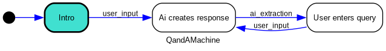

# Genie Flow
The Genie Flow Framework is intended to make it easy to design and implement dialogues between a
Human user and an LLM. Such dialogue is typically directed through a number of stages. Often they
start with a preamble, then some information retrieval, some conclusion building and an epilogue.

Keeping that state in check: what prompt should be used, given what has been discussed so far, is
not trivial. And when implemented using simple if / then / else logic, the code becomes hard to 
maintain.https://about.gitlab.com/releases/2024/05/08/patch-release-gitlab-16-11-2-released/

This package aims to simplify and streamline the creation of dialogue flows that have a user
interact with an LLM.

The main concept of Genie Flow is to maintain a State Machine, coupled with a Data Object.
The State Machine to direct the flow and determine which prompts to invoke when during the
conversation. The Data Object to carry all data that is gathered during the conversation.

These are only two classes that a developer would need to implement. The Genie Flow framework
takes care of creating sessions, persisting data, maintaining the dialogue history, calling
the LLMs asynchronously, and other feats.

## Genie Model
This is just a [pydantic](https://docs.pydantic.dev/latest/) model that can have as many fields as
one needs. A developer would subclass the `GenieModel` class, which adds a number of required
fields and methods. That `GenieModel` class also implements all functionality to persist it into
a Redis database. That functionality is based on the package [Pydantic-Redis](https://sopherapps.github.io/pydantic-redis/)
which implements the necessary ORM functionality.

### data object class fields

`state`
: This is the current state the accompanying State Machine is in. It is a string or an integer.
Best not to be touched by the developer.

`session_id`
: The unique id of a session that this Data Object belongs to. Best not to be touched by the
developer.

`dialogue`
: A list of `DialogueElement`s that is the sequence of utterings by the different actors involved
in the dialogue.

`running_task_id`
: The optional id of a [Celery](https://docs.celeryq.dev/en/stable/getting-started/introduction.html)
task that may be running as part of the dialogue. This could be, for instance, an LLM call that
has been triggered by a user input.

`actor`
: The name of the actor that has most recently uttered a statement. By default, this is `USER` for
a Human actor and `LLM` for an LLM.

`actor_input`
: The input that was last uttered by the most recent actor.

### data object methods and properties

The developer needs to override the property `state_machine_class` which should return the class
that implements the State Machine that accompanies this Data Object. The method 
`create_state_machine` will use the `state_machine_class` property to instantiate a new State
Machine and connect it to an instance of this Data Object.

Some convenience methods exist:

`current_response`
: A property that returns the most recent uttering of an actor. Or `None` if there is none.

`format_dialogue`
: Returns a string representation of the dialogue, using some pre-defined formats. See the 
`DialogueFormat` class for more details.

### related objects
If a developed needs to maintain a relation to other objects that are not base classes, the class
of that other object also needs to be ORM-able. This is achieved by inheriting that other class
not from `BaseModel` as is done for Pydantic, but by inheriting from `Model` which comes from the
Pydantic-Redis package.

This also means that this other object needs to have a class property called `_primary_key_field`
which is the name of the field that uniquely identified an instance of that object.

For example, the `DialogeElement` class (of which the `GenieModel` maintains a list) is implemented
as follows:

```python
import uuid

from pydantic import Field
from pydantic_redis import Model

class DialogueElement(Model):
    _primary_key_field = "id"

    id: str = Field(default_factory=lambda: uuid.uuid4().hex)
    
    # other fields and methods
```

And with that implementation, the `GenieModel` can now maintain a list of `DialogueElement`s that
are then also persisted into Redis. Like so:

```python
from pydantic import Field
from pydantic_redis import Model

class GenieModel(Model):
    _primary_key_field: str = "session_id"

    dialogue: list["DialogueElement"] = Field(
        default_factory=list
    )

    # other fields and methods
```

### Registering Models
When the developed has created a new `GenieModel`, that new model needs to be registered. This will
make that model recognized to the Pydantic-Redis ORM framework. This registration is done as follows:

```python
from ai_state_machine.genie_model import GenieModel
from ai_state_machine.store import STORE

class MyNewModel(GenieModel):
    ...

STORE.register_model(MyNewModel)
```

From that point onwards, the class `MyNewModel` can be persisted and therefore used by the Genie
Flow framework.

Remember that this also needs to be done for any additional models that may be referred to by this
`MyNewModel` class.

## State Machine
The backbone of the Genie Flow framework is defined by the State Machine. The Genie Flow State
Machine is based on the package [Python State Machine](https://python-statemachine.readthedocs.io/en/latest/)
and the `GenieStateMachine` is a direct subclass of the `StateMachine` class that is defined there.

The `GenieStateMachine` class implements the base logic of the Genie Flow. A State Machine defined
the different states (nodes in a graph) and the transitions (edges in the graph) that can be made
between these states.

## example: Question and Answer
A simple Question and Answer dialogue flow would look like this:



Here it becomes apparent that a dialogue is played between an "AI" and a human actor. The
dialogue stars with the initial state (color coded) called `Intro`. From that initial state
the only transition that can be made is the one called `user_input`, which transitions into
`Ai creates response`. From there, a transition called `ai_extraction` brings the state
machine into the state called `User enters query`. From there, the only transition is again
a `user_input` transition, back to the `Ai creates response`.

This example shows a number of foundational elements:

states
: A state machine contains a number of states between which the state machine can transition.
A machine can only be in one state at any single time. The transitions that can be made from
one state to another are predefined and fixed. Only one initial state is defined. It is the
state where a newly instantiated state machine starts in.

transitions
: From any state there can be zero, one or more transitions into other states. If there are
zero states, that state is a final state, of which there can be multiple (or none as in the
Q and A example). 