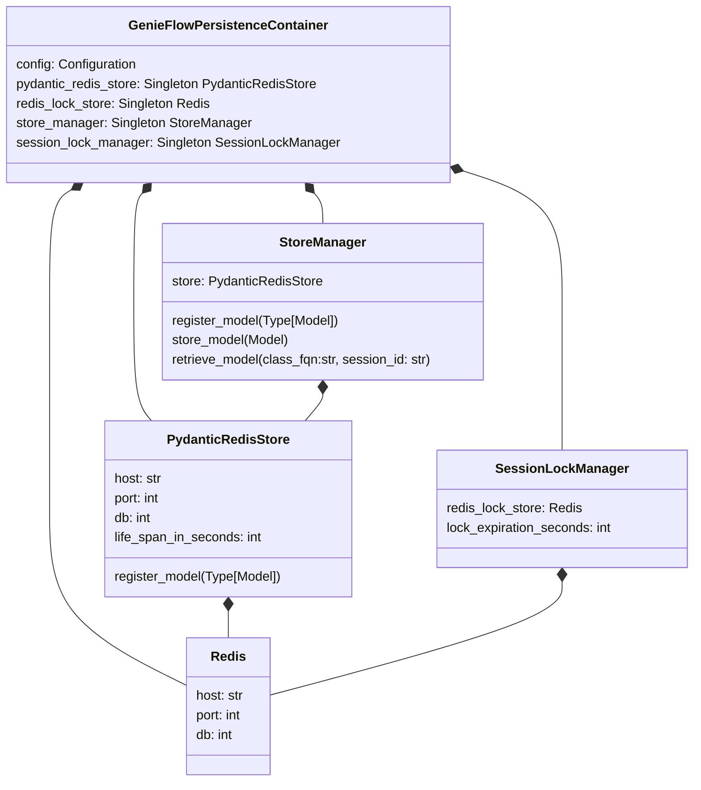

```mermaid
classDiagram
    
    class GenieFlowPersistenceContainer{
        config: Configuration
        pydantic_redis_store: Singleton PydanticRedisStore
        redis_lock_store: Singleton Redis
        store_manager: Singleton StoreManager
        session_lock_manager: Singleton SessionLockManager
    }
    
    class PydanticRedisStore{
        host: str
        port: int
        db: int
        life_span_in_seconds: int
        register_model(Type[Model])
    }
    
    class Redis{
        host: str
        port: int
        db: int
    }
    
    class StoreManager{
        store: PydanticRedisStore
        register_model(Type[Model])
        store_model(Model)
        retrieve_model(class_fqn:str, session_id: str)
    }
    
    class SessionLockManager{
        redis_lock_store: Redis
        lock_expiration_seconds: int
    }
    
    GenieFlowPersistenceContainer *-- PydanticRedisStore
    GenieFlowPersistenceContainer *-- Redis
    GenieFlowPersistenceContainer *-- StoreManager
    GenieFlowPersistenceContainer *-- SessionLockManager
    
    PydanticRedisStore *-- Redis
    
    StoreManager *-- PydanticRedisStore
    
    SessionLockManager *-- Redis

```