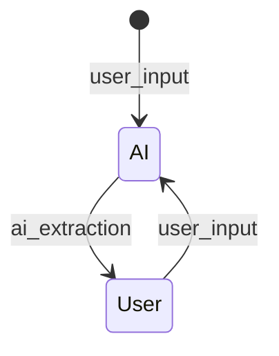

from genie_flow.genie import GenieStateMachinefrom genie_flow.model.dialogue import DialoguePersistencefrom genie_flow.model.dialogue import DialoguePersistencefrom genie_flow.model.dialogue import DialoguePersistence

# Genie Flow State Transitions

## Event Flow
The core of a Genie Flow agent is the State Machine. The different states that the machine
can be in and the transitions between these states. From the initial state onwards, the
Genie flow engine pushes through the state by means of "events". An event is the trigger
for the State Machine to leave a state and move to the next.

This chapter describes how the Genie engine interprets these events and uses the templates
and template meta data to conduct the dialogue.



In this simple diagram, we can see two transitions, "user_input" and "ai_extraction" that make 
the State Machine travel from the initial state and between the AI and User states.

The AI state is a so-called invoker state: it uses a template to conduct a background process
that will result in an output. The User state is a renderer state: it renders the output
and sends it back to the user.

## On States, Events and Templates

### events as triggers
A transition from one state (source state) to the next (target state) is triggered by sending
the State Machine an "event". A string with a name that represents something that happened.
Good examples of events are:

"user_input"
: an event that is typically sent by the user, accompanied by some input from the user. It
could be the question that a user asks, or a response to something the chat bot asks.

"ai_extraction"
: an event that is triggered when an invoker is finished, accompanied by the string output
of the invocation. It could be the answer to a question or an embedding of a chunk of a 
document.

"file_input"
: an event that is sent from the user, together with a base64 encoding of a file that the
user is sending.

But the development team is free to choose their event names and make them descriptive of the
event that happens when they are triggered.

### states have a type
There are two types of states: invoker states and rendered states. And all states have a
template.

"invoker state"
: A state that indicates that an invoker will be triggered, and we will have to wait till
the result is created. This could be an LLM call, an embedding or any other process that
is executed outside of the Genie Flow agent. Whenever the external service is complete,
the Genie Flow engine will trigger the next event, based on the transitions going out of
the state. This could be an "ai_extraction" event. With that event, the result of the
invocation is sent as a parameter.

"renderer state"
: These are states meant to render output to the user of the agent. The Genie engine will
construct the output, send it as output to the API and wait for the user to take action.

This means that, from the type of the state, we can induce which party has triggered the
transition – which party has sent the event. If the source state is an *invoker*, then we
know for certain that is was the party "assistant" who triggered the transition. Because
an invoker has been executed and the Genie engine automatically sends the outgoing event
to the State Machine. And when the source state is a *renderer* state, we know for sure that
the event was sent by the "user" – because a renderer state creates output, sends it as
output, and then it is up to the user to send a new event.

### template rendering
Every state has a template. A template is a combination of a Jinja2 text template
and a `meta.yaml` configuration. The configuration specifies if the template is an invoker,
making the attached state an Invoker state, or a renderer, which makes the state a
renderer state.

The template for an invoker state renders the input that will be sent to the invoker. For 
instance, if that invoker is an LLM, it is the prompt template. If the invoker calls an API,
the rendered template may be the JSON payload that is sent to the API.

And if the template is attached to a renderer state, the template is used to render the output
that needs to be sent to the user.

## On Transitions
When an event is sent to the State Machine, a whole tower of logic is set into motion. That
logic determines what data is made available, how the dialogue is persisted, and what special
actions the agent should take based during these transitions.

There are two important moments that the Genie engine hooks into: before and after the
transition. The agent developer has the ability to hook into different stages of the transition
to implement the necessary logic. The Genie engine is there to accommodate these actions,
as well as to record the dialogue correctly.

### transition hooks
The following groups of methods are called in sequence (if they exist). **Note: Within the group
the order of calling is not defined (and could be in parallel)**.

For [more information, please refer to the original documentation](https://python-statemachine.readthedocs.io/en/latest/actions.html#ordering).

| Group               | Hooks used by Genie   | Transition Hooks  | Event Hooks          | State Hooks                                      | Current state |
|---------------------|-----------------------|-------------------|----------------------|--------------------------------------------------|---------------|
| Validators          |                       |                   | `validators()`       |                                                  | `source`      |
| Conditions          |                       |                   | `cond()`, `unless()` |                                                  | `source`      |
| Before              | `before_transition()` |                   | `before_<event>()`   |                                                  | `source`      |
| Exit                |                       |                   |                      | `on_exit_state()`,<br/> `on_exit_<state.id>()`   | `source`      |
| On                  |                       | `on_transition()` | `on_<event>()`       |                                                  | `source`      |
| **STATE UPDATE**    |                       |                   |                      |                                                  |               |
| Enter               |                       |                   |                      | `on_enter_state()`,<br/> `on_enter_<state.id>()` | `destination` |
| After               | `after_transition()`  |                   | `after_<event>()`    |                                                  | `destination` |

The state machine package makes the machine go through each of these groups and checks if there
exist any of these hooks and calls them.

### before transition
The `before_transition()` hook is executed before any other transition hooks are called. It
sets up the parameters that are necessary to make the transition correctly and to provide
the agent developer with the correct information.

1. A value for `actor_input` is determined from the string argument that has been sent with
   the event. So, if the source state was an invoker state, this argument would be the
   output of the invoker; if the source state was a renderer state, this argument would be
   the text that was sent by the user.
2. The `source_type` and `target_type` are determined: these are the state types of the source
   and target states. They could be any combination of *renderer* and *invoker*.
3. The `actor` is determined: if the source state is a *renderer*, the `actor` is set to
   "user", else it is set to "assistant".
4. Dialogue persistence is determined for the source state and appropriately handled.

### after transition
When the transition is concluded, and potentially some actions have been conducted as programmed
by the agent developer, the Genie engine concludes the `after_transition()` hook.

At this point, the dialogue persistence is determined for the target state and appropriately
handled.

## Dialogue
Every Genie model contains a property `dialogue`. That property is a list of `DialogeElement`s.
These are pieces of content, uttered by actors, along the dialogue.

A `DialogueElement` contains

`actor`
: the string identifying the actor that made the uttering. Can be "user" or "assistant".

`timestamp`
: a `datetime` timestamp of when the uttering was made

`event`
: the string name of the event that triggered the uttering

`actor_text`
: the actual (optional) text that was uttered by the actor 

### what gets recorded
Not all utterings should be recorded in full. The dialogue is an integral part of the Genie
model and as such is stored as part of the session. As example: storing the raw `base64`
encoding of a large file is not the best use of session storage – especially when a parsed
and cleaned version of that file is also stored in the Genie model.

The Genie engine needs to determine what gets recorded during every transition. Observe the
following table:

| source   | target   | event         | source store        | target store             |
|----------|----------|---------------|---------------------|--------------------------|
| invoker  | renderer | ai_extraction | none                | rendered, as "assistant" |
| invoker  | invoker  | ai_extraction | none                | none                     |
| renderer | renderer | advance       | none                | rendered, as "assistant" |
| renderer | invoker  | advance       | none                | none                     |
| renderer | renderer | user_input    | store raw as "user" | rendered, as "assistant" |
| renderer | invoker  | user_input    | store raw as "user" | none                     |
| renderer | renderer | file_upload   | event only          | rendered, as "assistant" |
| renderer | invoker  | file_upload   | event only          | none                     |

The logic is:
* when we transition into a *renderer* state, the Genie agent is going to send some information
  to the user. That information is the result of rendering the template that belongs to that
  state.
* When we transition out of a *renderer* state, this will always be triggered by a user-
  induced event: a "user_input" or a "file_upload" event. Depending on the event, we may
  want to store the whole user input, only the event itself or nothing at all
* When we transition into an *invoker* state, the template is used to render the input to
  the invoker itself. Nothing is sent to the user and we will not store anything.
* When we transition out of an *invoker* state, the event carries the raw output of the
  invoker. We typically do not store that. If the target state happens to be a *renderer*
  state, the rendered template of that state will be stored as assistant uttering. 

Using the following flags, the Genie engine knows what to store when. These flags can be
combined.

`NONE`
: Nothing is recorded during the transition

`SOURCE_EVENT`
: Only the `event` is recorded, not the content that was passed with it.

`SOURCE_RAW`
: The `event` as well as the content that came with it is recorded. It will be recorded as
coming from the actor determined by the type of the source state.

`TARGET_RAW`
: The raw content is stored and recorded as coming from the actor determined by the type
of the target state.

`TARGET_RENDERERD`
: the template of the target state is rendered, and the result is stored as coming from the
actor determined by the type of the target state. But only if that target is a *renderer*
state.

To keep the dialogue complete but not store too much data, at every transition, the following
logic is applied:

#### 1. check for overrides
When the Genie model contains a (combined) persistence flag in the property `dialogue_persistence`
then that setting trumps any logic. This property can be used to override any persistence
logic at run-time.

#### 2. check the type of target state
If the target state is *not* a renderer state, then nothing gets recorded. This is typically
the case when the outcome of one invoker is fed into another invoker.

#### 3. check the `persistence` flags
The Genie State Machine carries a dictionary in the property `persistence`, that defines the
persistence flags for some of the standard events:

"user_input"
: Defined as `SOURCE_RAW | TARGET_RENDERED`. This means that the input sent by the user, 
with their "user_input" event, is stored as an uttering of a "user" actor. It also means that,
if the target state is a *renderer* state, the template of the target state is rendered and
the result of that is persisted as uttering of actor "assistant".

"ai_extraction"
: Defined as `TARGET_RENDERED`. This means that, if the target state is a *renderer* state,
that the template of the target state is rendered and that the result is then stored as an 
uttering of the "assistant" actor.

"advance"
: There is no input received with such event. But, if the target state is a *renderer* state,
the rendered template of that state will be stored as uttering of actor "assistant".

"file_upload"
: Defined as `SOURCE_EVENT | TARGET_RENDERED`. As a result, the event will be recorded as an
event triggered by the "user", but not the content. If the target state is a *renderer* state,
then the rendition of the template of that target state will be stored as an uttering of
actor "assistant".

#### 4. fall back to default
The default is set to `SOURCE_EVENT | TARGET_RENDERED` meaning that only the event is recorded,
no content, and that will be recorded as being triggered by the actor "user". Then, if the
target state is a *renderer* state, the rendered template is also stored as uttering by the
actor "assistant".

### overriding what gets recorded
If an agent developer wants to override what happens to the dialogue recording when a certain
event is sent, then the agent developer can ovrride and extend the `persistence` property.
For example, to include a definition for a new event "get_files", the agent developer can
implement the following:

```python
class MyAgentStateMachine(GenieStateMachine):
    ...

    @property
    def persistence(self) -> dict[str, DialoguePersistence]:
        result = super().persistence
        result["get_files"] = (
                DialoguePersistence.SOURCE_EVENT 
                | DialoguePersistence.TARGET_RAW
        )
        return result
```

This would add the event "get_files" as a non-default event that would store the event itself
as an event sent by the "user" and if the target state is a *renderer* state, then the raw
content that was sent with the "get_files" event will be stored as 

## Task Progress 
Next possible actions will only be "poll" when there is an active Celery DAG running for the
session. This is done internally by checking if a progress object exists for that session.

This progress object contains the total number of tasks as well as the total number of executed
tasks. This information could be used by a user interface to indicate task progress.

### task-finish indication
When a Celery task is finished (the invoker DAG has concluded), the progress object is removed.
When we do an Invoker to Invoker transition, a new task DAG will be created for the second
Invoker, and consequently a new progress object is created. This meas that there is a short
period in time where there is no progress object for a session, but there is also nothing
else that the user needs to do, other than "poll".

Since the removal of the old progress object and the creation of the new one is done within
the same model object lock, the API will not be able to see that intermediate state and falsely
conclude that there is no active task. When the API comes along for a "poll" it will wait till
all the activity is done (wait for the lock to be released) after which it will conclude that
there is an active task and suggest another "poll" event.

### false update of percentage done
This situation will also impact the "total nr of tasks" and "total nr executed tasks" reporting
that happens when the user polls. These numbers will only refer to the number of tasks that
are in the currently executing DAG. Automatically jumping to a new DAG will reset to a new number
of tasks and set the number of executed tasks to zero. If these numbers are used for feedback
to the user, this would be unexpected.

> This may be something to fix when we start using these numbers for user feedback.
