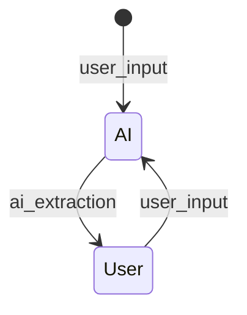

# Genie Flow State Transitions

## Event Flow
The core of a Genie Flow agent is the State Machine. The different states that the machine
can be in and the transitions between these states. From the initial state onwards, the
Genie flow engine pushes through the state by means of "events". An event is the trigger
for the State Machine to leave a state and move to the next.

This chapter describes how the Genie engine interprets these events and uses the templates
and template meta data to conduct the dialogue.

In this simple diagram, we can see two transitions, "user_input" and "ai_extraction" that make 
the State Machine travel from the initial state and between the AI and User states.

The AI state is a so-called invoker state: it uses a template to conduct a background process
that will result in an output. The User state is a renderer state: it renders the output
and sends it back to the user.

## On States, Events and Templates

### events as triggers
A transition from one state (source state) to the next (target state) is triggered by sending
the State Machine an "event". A string with a name that represents something that happened.
Good examples of events are:

"user_input"
: an event that is typically sent by the user, accompanied by some input from the user. It
could be the question that a user asks, or a response to something the chat bot asks.

"ai_extraction"
: an event that is triggered when an invoker is finished, accompanied by the string output
of the invocation. It could be the answer to a question or an embedding of a chunk of a 
document.

"file_input"
: an event that is sent from the user, together with a base64 encoding of a file that the
user is sending.

But the development team is free to choose their event names and make them descriptive of the
event that happens when they are triggered.

### states have a type
There are two types of states: invoker states and rendered states. And all states have a
template.

"invoker state"
: A state that indicates that an invoker will be triggered, and we will have to wait till
the result is created. This could be an LLM call, an embedding or any other process that
is executed outside of the Genie Flow agent. Whenever the external service is complete,
the Genie Flow engine will trigger the next event, based on the transitions going out of
the state. This could be an "ai_extraction" event. With that event, the result of the
invocation is sent as a parameter.

"renderer state"
: These are states meant to render output to the user of the agent. The Genie engine will
construct the output, send it as output to the API and wait for the user to take action.

This means that, from the type of the state, we can induce which party has triggered the
transition -- which party has sent the event. If the source state is an *invoker*, then we
know for certain that is was the party "assistant" who triggered the transition. Because
an invoker has been executed and the Genie engine automatically sends the outgoing event
to the State Machine. And when the source state is a *renderer* state, we know for sure that
the event was sent by the "user" -- because a renderer state creates output, sends it as
output, and then it is up to the user to send a new event.

### template rendering
Every state has a template. A template is a combination of a Jinja2 text template
and a `meta.yaml` configuration. The configuration specifies if the template is an invoker,
making the attached state an Invoker state, or a renderer, which makes the state a
renderer state.

The template for an invoker state renders the input that will be sent to the invoker. For 
instance, if that invoker is an LLM, it is the prompt template. If the invoker calls an API,
the rendered template may be the JSON payload that is sent to the API.

And if the template is attached to a renderer state, the template is used to render the output
that needs to be sent to the user.

## On Transitions
When an event is sent to the State Machine, a whole tower of logic is set into motion. That
logic determines what data is made available, how the dialogue is persisted, and what special
actions the agent should take based during these transitions.

There are two important moments that the Genie engine hooks into: before and after the
transition. The agent developer has the ability to hook into different stages of the transition
to implement the necessary logic. The Genie engine is there to accommodate these actions,
as well as to record the dialogue correctly. 

### before transition
The `before_transition()` hook is executed before any other transition hooks are called. It
sets up the parameters that are necessary to make the transition correctly and to provide
the agent developer with the correct information.

1. A value for `actor_input` is determined from the string argument that has been sent with
   the event. So, if the source state was an invoker state, this argument would be the
   output of the invoker; if the source state was a renderer state, this argument would be
   the text that was sent by the user.
2. The `source_type` and `target_type` are determined: these are the state types of the source
   and target states. They could be any combination of *renderer* and *invoker*.
3. The `actor` is determined: if the source state is a *renderer*, the `actor` is set to
   "user", else it is set to "assistant".
4. Dialogue persistence is determined for the source state and appropriately handled.

### after transition
When the transition is concluded, and potentially some actions have been conducted as programmed
by the agent developer, the Genie engine concludes the `after_transition()` hook.

At this point, the dialogue persistence is determined for the target state and appropriately
handeled.

### output
When user sends an event (including the "poll" event) to the API, the API will respond with either:
* a list of next actions containing only "poll"
* the output of the previous state, rendered into the template of the new state and a list of 
  next actions (events) that can be sent.

## Task Progress 
Next possible actions will only be "poll" when there is an active Celery DAG running for the
session. This is done internally by checking if a progress object exists for that session.

This progress object contains the total number of tasks as well as the total number of executed
tasks. This information could be used by a user interface to indicate task progress.

### task-finish indication
When a Celery task is finished (the invoker DAG has concluded), the progress object is removed.
When we do an Invoker to Invoker transition, a new task DAG will be created for the second
Invoker, and consequently a new progress object is created. This meas that there is a short
period in time where there is no progress object for a session, but there is also nothing
else that the user needs to do, other than "poll".

Since the removal of the old progress object and the creation of the new one is done within
the same model object lock, the API will not be able to see that intermediate state and falsely
conclude that there is no active task. When the API comes along for a "poll" it will wait till
all the activity is done (wait for the lock to be released) after which it will conclude that
there is an active task and suggest another "poll" event.

### false update of percentage done
This situation will also impact the "total nr of tasks" and "total nr executed tasks" reporting
that happens when the user polls. These numbers will only refer to the number of tasks that
are in the currently executing DAG. Automatically jumping to a new DAG will reset to a new number
of tasks and set the number of executed tasks to zero. If these numbers are used for feedback
to the user, this would be unexpected.

> This may be something to fix when we start using these numbers for user feedback.

## Dialogue (a.k.a. Chat History)
The model object contains a list of utterings of the different parties involved in the dialogue.
This alternates between "assistant" and "user". The first for output from an invoker, the
second for output sent through the API.

When strictly alternating between Invoker and User, then we expect this dialogue list to
contain the alternating utterings, starting with "assistant", followed by "user", then back
to "assistant", etc.

But exceptions exist. With the wqy the task flow is constructed, we could have user to user
or invoker to invoker transitions.

Another issue is when a user sends "technical" information, such as a file binary or control
element (buttons, drop-downs, etc) results. We may not want to record these - or maybe record
a derivative of them.

### what gets stored
When the transition is triggered from the API (so that is a user input), the string that accompanied
that event is stored verbatim. This means that, all user input is stored inside the chat
history, without interference.

When the transition is triggered by a Celery DAG, the output of that DAG (typically an Invoker)
is first used to render the template that is connected to the target state. This is the information
that is going to be sent back to the user, so that is also what is stored as part of the dialogue.

### Invoker to Invoker transitions
When passing from one Invoker to the next Invoker, the output of the first invoker is passed on
to the next invoker as `actor_input` but the default pattern is to NOT store this intermediate
result as part of the dialogue. It is assumed that this intermediate result is technical in
nature and should not feature as part of the chat history. Only the last Invoker of a sequence
like this, before control is handed back to the User, is stored. And since this is an Invoker
output, it is used to render the template of the target state and the result of that is stored
as part of the dialogue.

### User to User transition
In case a transition is made from a user state onto the next user state, this is assumed to be
important for the dialogue. Hence, the default is to store the `actor_input` into the dialogue.

## Advanced
The above should give you enough to start building Genie Agents. This chapter exists for when
you want further details on how the internals of Genie Flow work and want to use that information
to further enhance you flows.

### transition steps
To fully understand how the transition from one state to another is managed, one needs to
understand the following sequence. This sequence shows in what order the different "hooks" on
a state machine are being called during a transition. For [more information, please refer to
the original documentation](https://python-statemachine.readthedocs.io/en/latest/actions.html#ordering).

The following groups of methods are called in sequence (if they exist). **Note: Within the group
the order of calling is not defined (and could be in parallel)**.

| Group               | Hooks used by Genie   | Transition Hooks  | Event Hooks          | State Hooks                                      | Current state |
|---------------------|-----------------------|-------------------|----------------------|--------------------------------------------------|---------------|
| Validators          |                       |                   | `validators()`       |                                                  | `source`      |
| Conditions          |                       |                   | `cond()`, `unless()` |                                                  | `source`      |
| Before              | `before_transition()` |                   | `before_<event>()`   |                                                  | `source`      |
| Exit                |                       |                   |                      | `on_exit_state()`,  `on_exit_<state.id>()`   | `source`      |
| On                  |                       | `on_transition()` | `on_<event>()`       |                                                  | `source`      |
| **STATE UPDATE**    |                       |                   |                      |                                                  |               |
| Enter               |                       |                   |                      | `on_enter_state()`,  `on_enter_<state.id>()` | `destination` |
| After               | `after_transition()`  |                   | `after_<event>()`    |                                                  | `destination` |

The state machine package makes the machine go through each of these groups and checks if there
exist any of these hooks and calls them.

#### Genie Flow Hooks
In order to manage the Genie internals, the following hooks are implemented:

`before_transition()`
: this hook determines how the transition will be conducted. It will set the property
`transition_type` to a tuple containing the source type and the destination type. A type can
be either "invoker" or "user". So, for example, the tuple `("invoker", "user")` means that
the source state was an invoker state and the target a user state.
This hook also sets the `actor`, based on the type of the source state. The actor is either
"assistant" (source state was invoker type) or "user" (source state was user type).
And, finally, this hook determines if and how the event argument should be stored as part of
the dialogue. The property `dialogue_persistance` is set to "NONE", "RAW" or "RENDERED".

`after_transition()`
: this hook is used to trigger the Celery task, if the target state is an "invoker" state.
This hook also checks the `dialogue_persistence` property and determines if and what gets added
to the dialogue.

#### Genie Flow standard behaviour
The following standard behaviour drives how Genie Flow conducts it's logic:

| `transition_type`  | `agent`   | `dialogue_persistence` | Celery DAG |
|--------------------|-----------|------------------------|------------|
| user -> user       | user      | RENDERED               | no         |
| user -> invoker    | user      | RAW                    | yes        |
| invoker -> user    | assistant | RENDERED               | no         |
| invoker -> invoker | assistant | NONE                   | yes        |

#### deviating from the default
Although the general rules are sensible, and should cater to most of the use cases, one might
want to deviate from this pattern. The most obvious change is to change the `dialogue_persistence`
property. This will then influence how `actor_input` is stored as part of the dialogue.

Whatever hook is used by the Agenteer does not really matter. Since this property is set right
at the start of the transition (on the `before_transition()` hook), any hook after that (but
before the `after_transition()` hook) would work.

And, because these alterations make most sense for a specific transition rather than generically,
for all transitions, we suggest using the `on_enter_<state.id>()` hook. Just in time for the
`after_transition()` hook.